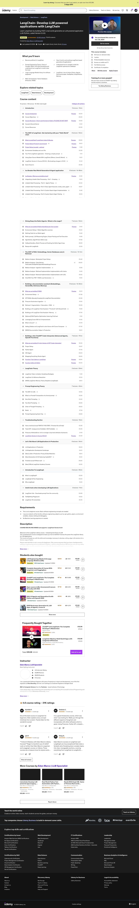

# UDEMY - Course - LangChain- Develop LLM powered applications with LangChain
- Course Online: https://www.udemy.com/course/langchain/
- Git repo: [udemy.edenmarco.langgchain.llmagents](https://github.com/oliverbarreto/udemy.edenmarco.langgchain.llmagents.git)
- Started: November 2024
- Finished: 

# Course Resources - Course Useful Links
- [Course Discord Community](https://discord.gg/SVcnbSjpXX)
- [Course Ice Breaker Github Repository](https://github.com/emarco177/ice_breaker)
- [Course Documentation Helper Github Repository](https://github.com/emarco177/documentation-helper)
- [LangChain Official Documentation](https://python.langchain.com/docs/introduction/)
- [Prompt Engineering Theory Section](https://www.udemy.com/course/langchain/learn/lecture/46160669/?instructorPreviewMode=student_v4#overview) 
- [Course Troubleshooting Section](https://www.udemy.com/course/langchain/learn/lecture/38302002#overview)

# Course Completion Certificate:

# Course content:

---

# Course Details

⚠️ COURSE WAS RE-RECORDED and supports- LangChain Version 0.3.0

Welcome to first LangChain Udemy course - Unleashing the Power of LLM!
This comprehensive course is designed to teach you how to QUICKLY harness the power the LangChain library for LLM applications.
This course will equip you with the skills and knowledge necessary to develop cutting-edge LLM solutions for a diverse range of topics.

Please note that this is not a course for beginners. This course assumes that you have a background in software engineering and are proficient in Python. I will be using Pycharm IDE but you can use any editor you'd like since we only use basic feature of the IDE like debugging and running scripts .

In this course, you will embark on a journey from scratch to building a real-world LLM powered application using LangChain.
We are going to do so by build 3 main applications:

Ice Breaker- LangChain agent that given a name, searches in google to find Linkedin and twitter profiles, scrape the internet for information about a name you provide and generate a couple of personalized ice breakers to kick off a conversation with the person.

Documentation Helper- Create chatbot over a python package documentation. (and over any other data you would like)

A slim version of ChatGPT Code-Interpreter

Prompt Engineering Theory Section

## The topics covered in this course include:
- LangChain
- LLM + GenAI History
- LLMs: Few shots prompting, Chain of Thought, ReAct prompting
- Chat Models
- Open Source Models
- Prompts, PromptTemplates, langchainub
- Output Parsers, Pydantic Output Parsers
- Chains: create_retrieval_chain, create_stuff_documents_chain
- Agents, Custom Agents, Python Agents, CSV Agents, Agent Routers
- OpenAI Functions, Tool Calling
- Tools, Toolkits
- Memory
- Vectorstores (Pinecone, FAISS)
- RAG (Retrieval Augmentation Generation)
- DocumentLoaders, TextSplitters
- Streamlit (for UI)
- LCEL
- LangSmith
- Intro to LangGraph
- FireCrawl
- GIST of Cursor IDE
- Cursor Composter
- Curser Chat

Throughout the course, you will work on hands-on exercises and real-world projects to reinforce your understanding of the concepts and techniques covered. By the end of the course, you will be proficient in using LangChain to create powerful, efficient, and versatile LLM applications for a wide array of usages.

This is not just a course, it's  also  a community. Along with lifetime access to the course, you'll get:

Dedicated 1 on 1 troubleshooting support with me

Github links with additional AI resources, FAQ, troubleshooting guides

Access to an exclusive Discord community to connect with other learners (5000+ members)

No extra cost for continuous updates and improvements to the course

## DISCLAIMERS

1. Please note that this is not a course for beginners. This course assumes that you have a background in software engineering and are proficient in Python.
I will be using Pycharm IDE but you can use any editor you'd like since we only use basic feature of the IDE like debugging and running scripts.

2.The first project of the course (Ice-Breaker) requires usage of 3rd party APIs-
ProxyURL, SerpAPI, Twitter API  which are generally paid services.
All of those 3rd parties have a free tier we will use to create stub responses development and testing.

## What you’ll learn
- Become proficient in LangChain
- Have 3 end to end working LangChain based generative AI applications
- Prompt Engineering Theory: Chain of Thought, ReAct, Few Shot prompting and understand how LangChain is build under the hood
- Understand how to navigate inside the LangChain opensource codebase
- Large Language Models theory for software engineers
- LangChain: Lots of chains Chains, Agents, DocumentLoader, TextSplitter, OutputParser, Memory
- RAG, Vectorestores/ Vector Databasrs (Pinecone, FAISS)

##  Are there any course requirements or prerequisites?
- This is not a beginner course. Basic software engineering concepts are needed
- I assume students will be familiar software engineering subjects such as: git, python, pipenv, environment variables, classes, testing and debugging
- No Machine Learning experience is needed.

## Who this course is for:
- Software Engineers that want to learn how to build Generative AI based applications with LangChain
- Developers that want to learn how to build Generative AI based applications with LangChain
- Engineers that want to learn how to build Generative AI based applications with LangChain

## Instructor

Eden Marco | LLM Specialist
Best Selling Instructor

I am a passionate Software Engineer with years of experience in back-end development, one of the first engineers at Orca Security, and now I am working as a Customer Engineer at Google Cloud.

BSC in Computer Science from the Technion - Israel Institute of Technology

I have always been a fan of teaching and mentorship and I am teaching CS courses(Functional Programming and Introduction to CS) at Reichman University, Israel.

---

posted an announcement · 1 month ago (November 2024)
Course Updates: LangChain 0.3+, New Videos + Sections
Hi there! Eden here.

I'm excited to announce a major overhaul of the course, bringing you the latest in AI and the GenAI stack. I've been hard at work ensuring that every aspect of the course is up-to-date with LangChain🦜️🔗 0.3+ compatibility. Here's what's new:

🆕 New Videos and Content

Open Source Models: A new video integrating open-source language models.

FireCrawl for RAG 🔥: Learn about this powerful scraping tool for better RAG.

Cursor IDE for UI: Discover how to leverage Cursor IDE to improve our user interfaces.

LangGraph Memory (Theory): A look at memory management using LangGraph.

GenAI & Privacy: Exploring the critical intersection of generative AI apps and data privacy.

Generative UI: Create GenAI natural user interfaces with CopilotKit.

🔄 Updated Sections

Ice Breaker: Now updated to version 0.3+, including Pydantic updates in line with LangChain 0.3.

Documentation Helper: Refreshed to version 0.3+ for seamless integration.

🆕 New Sections

GenAI Apps in Production: Real-world applications and considerations for deploying generative AI.

Introduction to LangGraph: A quick primer on LangGraph, setting the stage for my dedicated LangGraph course (for which this course is a prerequisite).

LangGraph 🦜🕸️- Why This Matters

LangChain is rapidly evolving, with they are very bullish towards LangGraph for agentic workflows. These updates ensure you're at the forefront of these developments, equipped with the latest tools and knowledge in the field.

I added quick peek to LangGraph, setting the stage for my dedicated LangGraph course (for which this course is a prerequisite). I find combining the topics together is overwhelming for most people thats why this is a separate course :)

⚠️ FOR THOSE WHO ARE TAKING THE COURSE NOW:

While Iv'e updated most of our videos to align with LangChain 0.3+, there might be some discrepancies that could lead to compatibility issues, such as incorrect import errors.
1. Please let me know so I can address this
2. Please bear with us during this transition :)
3. I would suggest that you use the main branch in the course's repository as a reference point- and as always would highly recommend joining the discord community for assistance

🔜 Upcoming Additions: excited to announce that a new section will be added to the course within the next few weeks. Stay tuned for more enriching content! 📚✨

⭐ Your Feedback Matters! ⭐

If you've found value in this course, I'd be incredibly grateful if you could take a moment to leave a review on Udemy. Your feedback not only motivates me to keep improving and adding new content, but it also helps other students decide if this course is right for them. Every review, whether it's a glowing 5-star or constructive criticism, helps me make this course better for you and future students. Thank you for your support! 🙏💖

Join Our  Discord Community! 🎉

Don't forget to join our amazing Discord community! It's the perfect place to:

Ask questions and get help from fellow students and me

Share ideas and discuss the latest trends in AI and LangChain

Showcase your projects and get feedback

Network with like-minded individuals passionate about AI